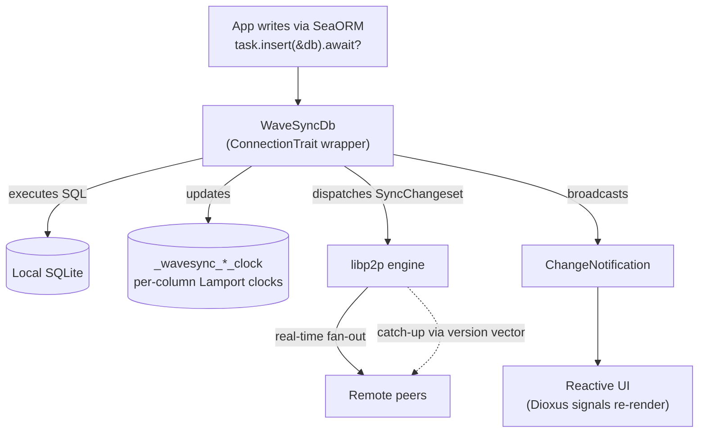
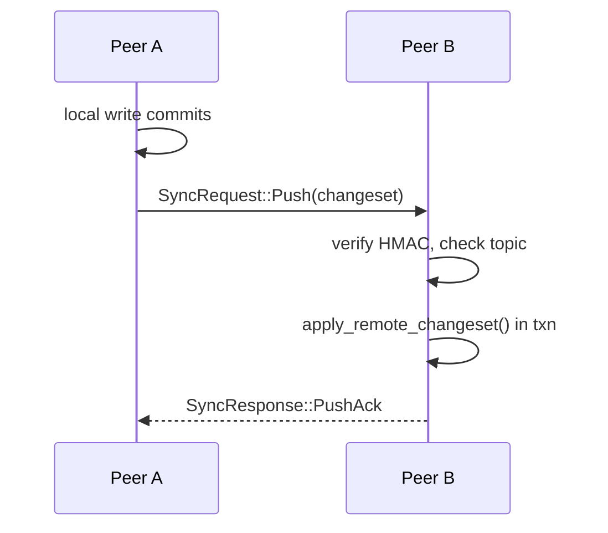
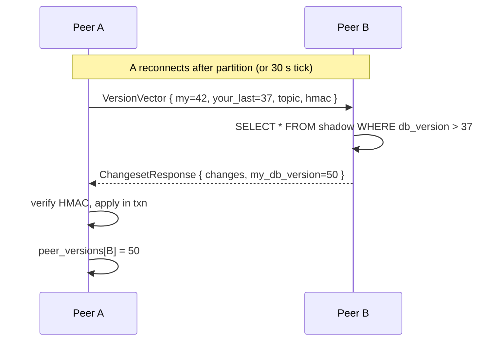

# Architecture

WaveSyncDB sits between your application code and SeaORM. From your code's perspective it's a `ConnectionTrait`. Underneath, every write is parsed, recorded in a shadow table, and dispatched to a libp2p engine that fans the change out to peers.

## The write path

The local write commits before any network I/O. If every peer is unreachable, your application keeps working — the change waits in the shadow table until a peer reconnects and asks for it.

## Two sync paths

### Real-time fan-out

Each local write produces a `SyncChangeset` that is sent to every currently-connected peer via libp2p's request-response protocol. Receivers verify the HMAC, check the topic matches, then call `apply_remote_changeset()` and respond with `PushAck`. This is the fast path for live collaboration: typically <100 ms when peers are directly connected.

### Catch-up via version vector

A new peer with no entry in `_wavesync_peer_versions` sends `your_last_db_version = 0`, which the receiver interprets as "give me everything". This is the only initial-state-transfer mechanism — there is no separate snapshot protocol.

## Shadow tables

For each synced table `tasks`, WaveSyncDB creates `_wavesync_tasks_clock` with primary key `(pk, cid)` (row id + column id). Each row records the column's current value, its Lamport clock (`col_version`), and the site id of the last writer.

The shadow table is what makes per-column conflict resolution work, what lets a peer answer "give me everything since version N" with a fast indexed query, and what lets WaveSyncDB resume sync correctly after a restart (because `db_version` is also persisted on every increment).

See [Schema & registration](/docs/schema) for the exact shadow-table schema.

## What you don't have to think about

- **Connection management** — the engine handles dial loops, reconnection, NAT traversal, and relay reservations.
- **Schema migration timing** — `get_schema_registry().sync()` creates entity tables and shadow tables atomically before the engine accepts inbound writes.
- **Ordering** — peers can apply changesets in any order; the per-column total ordering ensures everyone converges.
- **Idempotency** — duplicate deliveries are no-ops; the shadow-table comparison rejects equal-or-stale incoming changes.

## Further reading

- [Sync protocol](/docs/sync-protocol) — the wire format and message types.
- [Conflict resolution](/docs/conflict-resolution) — the deterministic ordering that makes convergence work.
- [Networking & discovery](/docs/networking) — how peers find each other.
- [API reference](/docs/api-reference) — the types you actually call.
