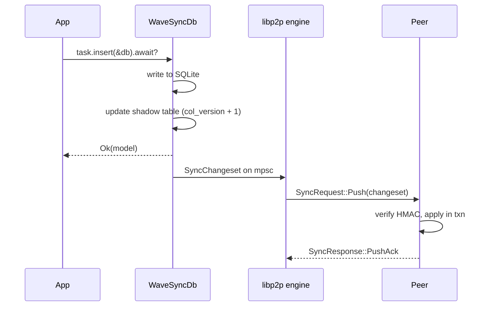
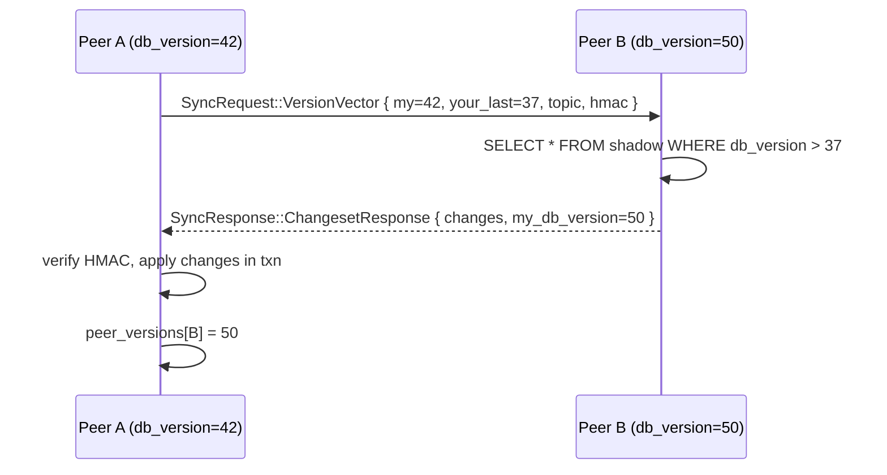

# Sync protocol

This page is the protocol-level deep dive. If you only want to use the library, the [Architecture](/docs/architecture) overview is enough — read this when you're debugging a sync bug, building a non-Rust client, or curious about the wire format.

## Two complementary paths

WaveSyncDB runs **two** sync paths in parallel. They serve different purposes and are both required for correct convergence.

| Path | Trigger | Latency | What it solves |
|---|---|---|---|
| **Real-time fan-out** | every local write | ~10–100 ms (LAN), ~200–800 ms (WAN) | live collaboration: peers see each other's edits as they happen |
| **Catch-up via version vector** | peer connect, periodic interval | one round trip | a peer that was offline gets everything it missed in a single batch |

Without real-time fan-out, peers would have to wait up to one sync interval (default 30 s) to see each other's writes. Without catch-up, a peer that misses a single fan-out (e.g., it was disconnected for 50 ms) would be permanently inconsistent until the next write.

## Real-time fan-out

When you call `task.insert(&db).await?`, WaveSyncDB:

1. Executes the SQL on the local SQLite (synchronously, so the call returns the same way SeaORM normally returns).
2. Parses the SQL to extract column-value pairs.
3. Increments `db_version` in `_wavesync_meta`.
4. Writes one row per changed column into the table's shadow table with the new `(col_version, value_bytes, site_id)`.
5. Builds a `SyncChangeset` and pushes it onto the engine mpsc.
6. The engine signs the changeset (HMAC-BLAKE3 if a passphrase is set), then sends it via libp2p **request-response** to every currently-connected peer.
7. Each receiver verifies HMAC, checks the topic matches, calls `apply_remote_changeset` in a transaction, and replies `PushAck`.



The local write is **already committed** before the network step starts. If every peer is unreachable, your application keeps working — the change waits in the shadow table until catch-up delivers it.

## Catch-up via version vector

When a peer reconnects (or every `sync_interval`, default 30 s), each peer asks each connected peer:

> *"I'm at `db_version = 42`. Last time we talked, you were at `db_version = 37`. What have you got that's newer than 37?"*

The receiver replies with every changeset newer than that version. After applying them, the requester writes `_wavesync_peer_versions[remote_site_id] = remote_db_version` so the next round can pick up where this one ended.



A new peer with no entry in `_wavesync_peer_versions` sends `your_last_db_version = 0`, which the receiver interprets as "give me everything". This is the only initial-state-transfer mechanism — there is no separate snapshot protocol.

## Wire format

All messages are JSON for ease of debugging — performance critical work happens at the SQLite layer, not the wire. Each request-response message is length-prefixed:

| Protocol | Prefix | Why |
|---|---|---|
| `/wavesync/snapshot/2.0` (catch-up + push) | 4-byte **big-endian** | matches libp2p convention |
| `/wavesync/auth/2.0` (challenge handshake) | 4-byte **little-endian** | legacy, predates the snapshot protocol |

These prefix encodings **must match** between peers — a peer that sees the wrong endianness will reject the message. The protocol identifier strings are how peers discover whether they speak compatible versions: a mismatch means the request-response handler refuses the substream and the connection survives but doesn't sync.

## Message types

### `SyncRequest`

```rust
enum SyncRequest {
    /// Catch-up question.
    VersionVector {
        my_db_version: u64,
        your_last_db_version: u64,
        site_id: NodeId,
        topic: TopicString,
        hmac: HmacTag,
    },
    /// Real-time fan-out: "here's a fresh changeset, please apply".
    Push(SyncChangeset),
}
```

### `SyncResponse`

```rust
enum SyncResponse {
    ChangesetResponse {
        changes: Vec<SyncChangeset>,
        my_db_version: u64,
    },
    PushAck,
    Reject(String), // topic mismatch, HMAC fail, schema unknown, ...
}
```

### `SyncChangeset`

```rust
struct SyncChangeset {
    table: TableName,
    primary_key: PrimaryKey,
    write_kind: WriteKind, // Insert | Update | Delete
    column_changes: Vec<ColumnChange>,
    db_version: u64,
    site_id: NodeId,
    topic: TopicString,
    hmac: HmacTag,
}
```

### `ColumnChange`

```rust
struct ColumnChange {
    column: ColumnName,
    value: Option<Vec<u8>>, // None for tombstones / unset columns
    col_version: u64,        // Lamport clock for this (row, column)
    site_id: NodeId,         // tiebreaker
}
```

Each column has its own `col_version` — that's what makes per-column conflict resolution possible. See [Conflict resolution](/docs/conflict-resolution) for the comparison rules.

## Authentication

When a passphrase is configured, **every** request-response message carries an HMAC-BLAKE3 tag computed over the canonical message bytes. The shared key is `BLAKE3(passphrase)`, identical on every peer in the group.

The HMAC verification is **mandatory on every path** — `Push`, `VersionVector`, and `ChangesetResponse`. Skipping HMAC on any path means a malicious peer can inject changesets via that path. This has been a real bug class in past versions: HMAC was once present on real-time push but missing on the catch-up path, leaving an unauthenticated full-sync vector wide open. The current code verifies on all three.

The HMAC input does **not** include wall-clock time. Peers don't share a clock and including time would break verification under skew. See [Authentication & security](/docs/authentication) for the full threat model.

## Topic isolation

Every message carries a `topic` field. The receiver checks `topic_in_message == my_topic` and silently rejects on mismatch. The topic is added to a permanent `rejected_peers` set so reconnects from that peer don't repeatedly trigger sync attempts.

The topic is derived as `BLAKE3(user_topic || passphrase)` — see [Authentication & security](/docs/authentication).

## What this guarantees

Given the protocol above, two peers in the same topic with the same passphrase **always** converge to the same state, regardless of message arrival order, partitions, restarts, or duplicate deliveries. The proof is straightforward:

1. **Eventual delivery**: catch-up via version vector eventually delivers every change to every peer.
2. **Deterministic resolution**: per-column conflict resolution is a strict total ordering with no time/random/order dependency, so any set of inputs reduces to a single output.
3. **Idempotency**: applying the same change twice (e.g., due to a duplicate `Push` and a redundant catch-up) is a no-op — the shadow-table comparison rejects equal-or-stale incoming changes.

If you observe non-convergence in practice, it is a bug in implementation, not a flaw in the protocol. The integration tests under `wavesyncdb/tests/` exercise these properties continuously.

## Where to go from here

- [Architecture](/docs/architecture) — the same content at the conceptual level.
- [Conflict resolution](/docs/conflict-resolution) — the per-column total ordering.
- [Authentication & security](/docs/authentication) — passphrase, HMAC, threat model.
