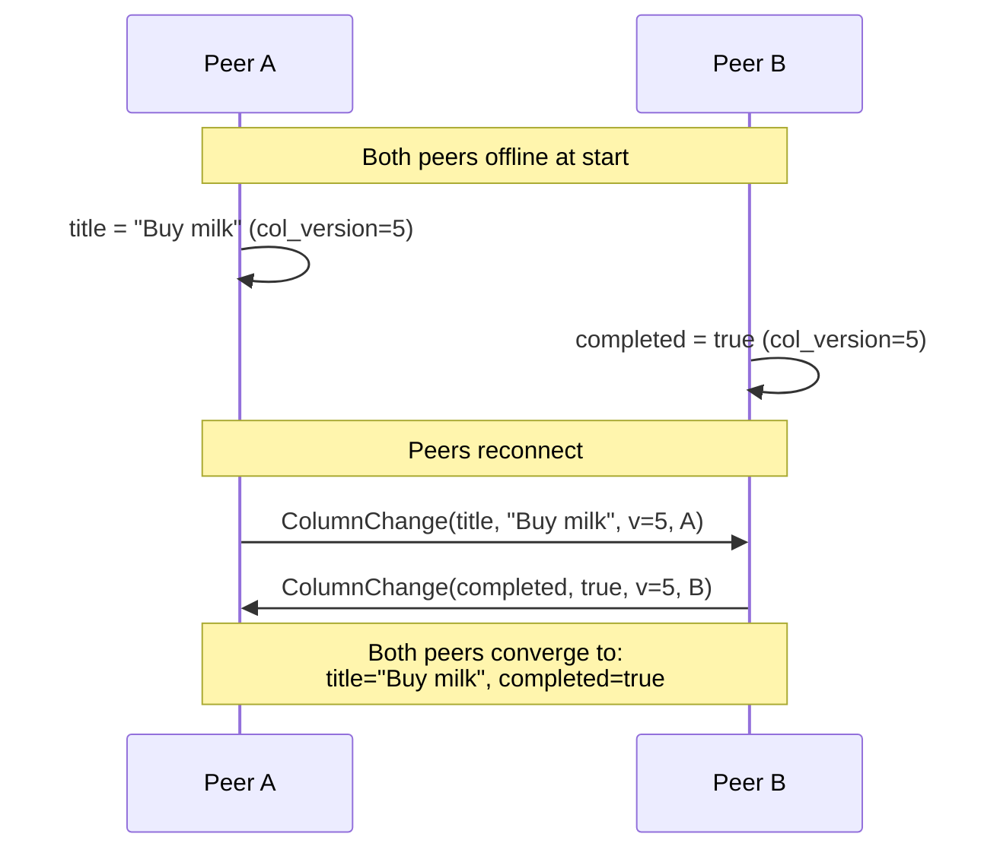
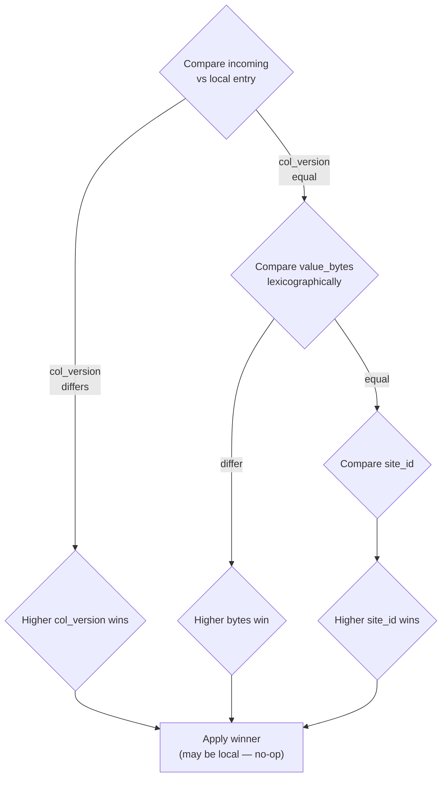

# Conflict resolution

When two peers edit the same data at the same time without seeing each other's writes, both edits land — but the network has to converge to a single state. WaveSyncDB uses **per-column Lamport clocks** with a deterministic tiebreaker to make that happen.

## Per-column instead of per-row

Many sync systems use last-write-wins on the entire row: whoever wrote most recently wins, the other write is discarded. That's lossy by design — if peer A toggles `completed` and peer B edits `title` at the same moment, one of those two updates disappears.

WaveSyncDB tracks every column independently. Concurrent edits to *different* columns of the same row both survive. Only edits to the *same* column conflict, and those resolve deterministically.



## The total ordering

For each column, the shadow table records `(col_version, value_bytes, site_id)`. When a remote change arrives, WaveSyncDB compares it against the local entry using strict total ordering:

1. **Higher `col_version` wins.** The Lamport clock is incremented monotonically by every writer, so higher means "happened later in causal order".
2. **If `col_version` is equal**, compare `value_bytes` lexicographically. Higher bytes win.
3. **If both are equal**, compare `site_id`. Higher site id wins.



This ordering is total — for any two changes you can compute the winner with no extra context. It is also deterministic: every peer that sees the same set of changes computes the same winner. No wall-clock time, no random tiebreakers, no peer-arrival-order dependence.

## A worked example: same-column conflict

Consider two peers both editing `title` on row `id="task-1"` while disconnected from each other:

| Step | Peer | Action | Shadow row after |
|---|---|---|---|
| 1 | A | `UPDATE tasks SET title='Eggs' WHERE id='task-1'` | `(task-1, title) → ('Eggs', col_version=5, site=A)` |
| 2 | B | `UPDATE tasks SET title='Bread' WHERE id='task-1'` | `(task-1, title) → ('Bread', col_version=5, site=B)` |
| 3 | A→B | A sends `ColumnChange(title, 'Eggs', v=5, A)` to B | B compares against its local: `v=5` equal → compare bytes: `'Eggs' < 'Bread'` → B keeps `'Bread'`. No-op. |
| 4 | B→A | B sends `ColumnChange(title, 'Bread', v=5, B)` to A | A compares against its local: `v=5` equal → compare bytes: `'Bread' > 'Eggs'` → A applies. |

Both peers end at `title='Bread'`. The order in which the two messages arrive doesn't matter — the bytewise tiebreaker gives the same answer either way. This is what "deterministic convergence" looks like.

## Deletes

Deletes are tracked the same way — a delete is a column write that sets a tombstone marker. A configurable `DeletePolicy` per table controls what happens when a delete races a concurrent write:

- **`DeleteWins`** (default) — the row is removed. A re-insert of the same primary key on another peer is rejected. Use for normal CRUD.
- **`AddWins`** — concurrent writes to a row that's being deleted resurrect it. Useful for shared inboxes where dropping a message is worse than seeing a duplicate.

```rust
// Set the policy when registering an entity manually:
use wavesyncdb::messages::DeletePolicy;
db.get_schema_registry("my_crate")
    .register_with_policy::<inbox::Entity>(DeletePolicy::AddWins)
    .sync()
    .await?;
```

The `#[derive(SyncEntity)]` macro defaults to `DeleteWins`. To override, register the entity manually instead of relying on auto-discovery.

## Why determinism matters

Any non-deterministic tiebreaker (timestamps, random numbers, "first-seen") means two peers can independently resolve the same conflict to different values. The mesh would never converge — they would keep overwriting each other.

This is why WaveSyncDB **never** uses wall-clock time in conflict resolution. Clock skew between phones, laptops, and servers is enough to break convergence. Lamport clocks plus byte-level tiebreaking is the smallest deterministic system that solves the problem.

## What you'll see in practice

- **Both columns updated concurrently** → both survive.
- **Same column, different values** → the deterministic winner is applied; everyone agrees.
- **Same column, same value** → idempotent; no-op.
- **Long offline period** → on reconnect, the version vector replays everything that was missed in one round trip.
- **A peer crashes mid-write** → since shadow + entity update + version increment happen in one transaction, you never end up with a half-applied write that survives the restart.

You don't write any of this code. The library does it for you behind `task.insert(&db).await?`.

## Where to go from here

- [Schema & registration](/docs/schema) — the shadow-table schema.
- [Sync protocol](/docs/sync-protocol) — how column changes ride the wire.
