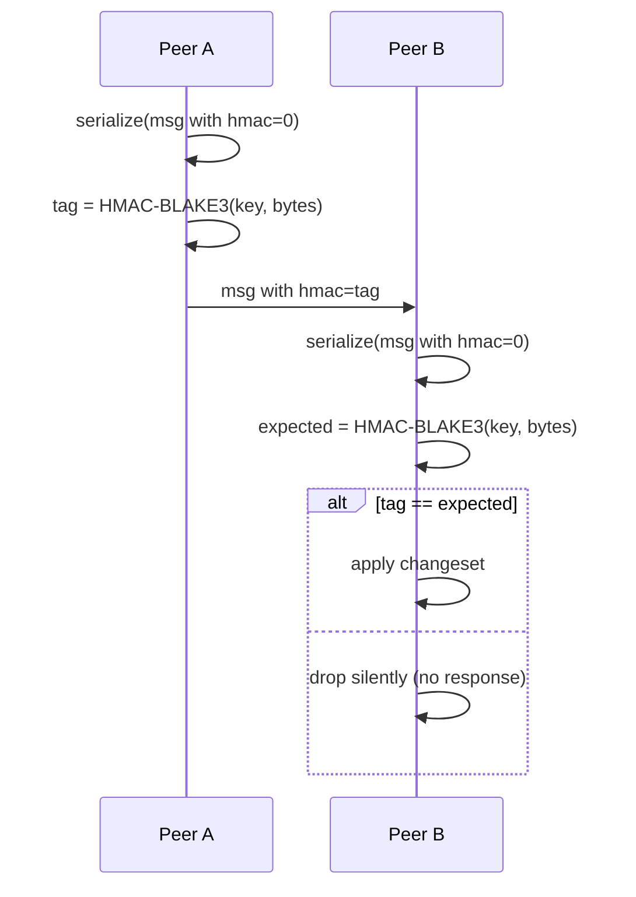

# Authentication & security

WaveSyncDB ships with **group authentication** — a single shared passphrase grants membership to a sync mesh. This page documents how that works, what threat model it covers, and where the limits are.

## The two layers

| Layer | Mechanism | Stops |
|---|---|---|
| **Topic isolation** | derived topic via `BLAKE3(user_topic ‖ passphrase)` | unrelated peers ever attempting to talk to each other |
| **Message authentication** | HMAC-BLAKE3 over every request-response message | impostors injecting changes after a peer joins the topic |

Both are required. Topic isolation alone is brittle (an attacker who guesses the topic could write whatever they want); HMAC alone leaks topic membership. Together, peers without the passphrase cannot even discover other peers in the mesh, let alone influence them.

## How the topic is derived

```rust
let derived_topic = blake3(format!("{user_topic}\0{passphrase}").as_bytes());
```

The derived topic — not the raw `user_topic` you pass to `WaveSyncDbBuilder::new()` — is what's:

- announced via mDNS service records,
- registered against in libp2p rendezvous,
- carried in the `topic` field of every sync message.

Two consequences:

1. **Two apps that happen to share a `user_topic` string but use different passphrases are completely isolated.** They can run on the same LAN without seeing each other.
2. **An attacker scanning mDNS sees opaque BLAKE3 hashes**, not the raw application topic. They can detect *that* a WaveSyncDB-style app is running but not which one.

## How HMAC is computed

Every `SyncRequest`, `SyncResponse`, and `SyncChangeset` carries an `HmacTag` field. The signing process:

1. Serialise the message with the `hmac` field set to a deterministic placeholder (32 zero bytes).
2. Compute `tag = blake3_keyed(key = blake3(passphrase), data = serialized_bytes)`.
3. Replace the placeholder with the tag and send.

Verification on the receiver mirrors this exactly. If the tag doesn't match, the message is **silently dropped** — no error response is returned, because returning one would let an attacker probe for valid topics.



## Why HMAC is on every path

When a passphrase is set, HMAC verification is **non-optional** on:

- real-time `Push` messages (changesets),
- catch-up `VersionVector` queries,
- catch-up `ChangesetResponse` replies.

Skipping verification on any one of these is enough to bypass authentication entirely. A peer that authenticates the live push path but trusts catch-up unconditionally is wide open: an attacker just sends a `VersionVector` query, gets the full database back, and then sends a fake `ChangesetResponse` to inject arbitrary state. The fact that the live path is signed is irrelevant — the catch-up path *is* a full-sync vector.

This has been a real bug class in past versions of similar software (and in earlier WaveSyncDB development before the catch-up HMAC was wired up). The current implementation enforces HMAC across all three message kinds in tests.

## What HMAC does NOT include

The HMAC input is exactly the canonical serialization of the message's content fields. It deliberately excludes:

- **Wall-clock time.** Peers' clocks drift by minutes (and across timezones, by hours) — including time would mean valid messages randomly fail to verify under skew. Replay protection comes from the per-column Lamport clocks: an attacker replaying an old `SyncChangeset` produces a no-op, because the existing local clock already dominates.
- **The HMAC tag field itself.** That's the placeholder pattern above.
- **libp2p transport metadata** (peer IDs, multiaddrs). Those are authenticated separately by Noise on the libp2p connection layer.

## Threat model

### What this protects against

- ✅ **Eavesdroppers on the same LAN** can't decrypt or inject — TLS-equivalent privacy comes from libp2p's Noise transport, applied to every connection.
- ✅ **Other apps on the same network** with their own WaveSyncDB instances and different passphrases. Topic isolation makes them invisible to each other.
- ✅ **Replay attacks** via stale changesets. The Lamport-clock-driven conflict resolution ignores anything older than the current local state.
- ✅ **A peer being kicked out** of the group. Rotate the passphrase: old peers lose access immediately on the next sync.

### What this does NOT protect against

- ❌ **A compromised passphrase.** Anyone holding the passphrase has full read/write access to the mesh. Treat it like a database password.
- ❌ **A malicious peer inside the group.** WaveSyncDB has no notion of "read-only" or "scoped" access. Every authenticated peer can write anything to any synced table. This is by design — the model is "small group of trusted devices", not "untrusted multi-tenant".
- ❌ **Side channels.** A passive observer can measure traffic volume and timing. They can infer when a sync is happening even if they can't read its content.
- ❌ **Compromised endpoints.** If an attacker gets root on a peer device, they get the database. WaveSyncDB does not encrypt SQLite at rest.

## Choosing a passphrase

- Use a randomly generated string at least 128 bits of entropy. `openssl rand -base64 32` is fine. Don't use a memorable word.
- Pass it through your app's secret-management layer — `keyring` on desktop, `EncryptedSharedPreferences` / `Keychain` on mobile.
- Rotating the passphrase requires every peer to update simultaneously. There is no graceful rotation protocol.

## What if I don't set a passphrase?

If you call `WaveSyncDbBuilder::new(url, topic).build()` with no `with_passphrase(...)`, you get:

- **No HMAC** on messages.
- **No `\0passphrase` mixed into the topic** — the raw topic string is hashed alone.
- **Anyone on the topic** can read and write the database.

This is appropriate for:

- Development and testing on isolated networks.
- Public, read-only datasets where there's no value in restricting writers.
- Scenarios where libp2p's transport-layer Noise is enough and the application doesn't care about topic squatting.

It is **not** appropriate for any user-data-bearing production app on a shared network.

## See also

- [Sync protocol](/docs/sync-protocol) — the wire-format details that HMAC covers.
- [Networking & discovery](/docs/networking) — what mDNS / rendezvous / relay see in the topic field.
