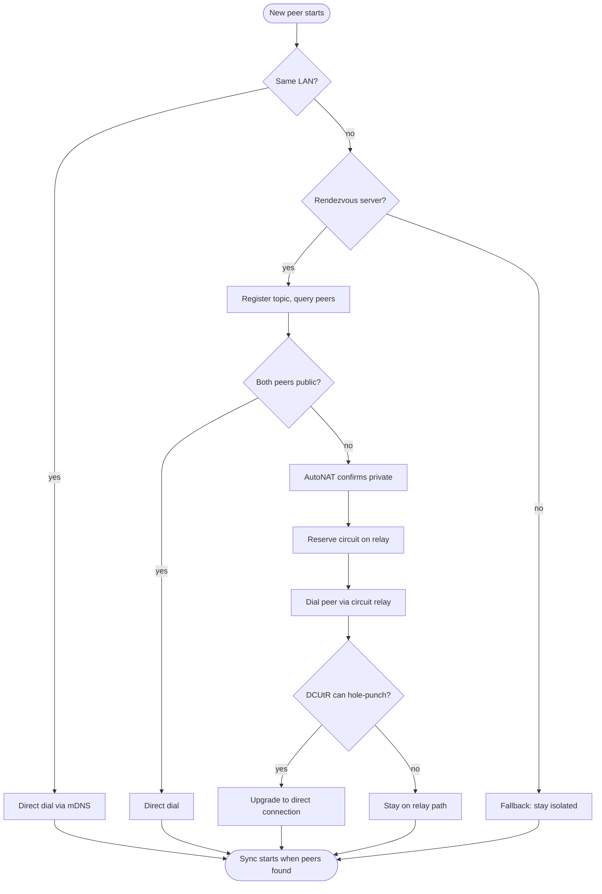

# Networking & discovery

How does a fresh peer find the others? WaveSyncDB layers four discovery mechanisms, each filling a different gap.



## Layer 1 — mDNS (LAN)

The first layer is **multicast DNS** (`libp2p-mdns`). The engine periodically broadcasts a `_wavesync._udp.local.` query and listens for responses. Every WaveSyncDB peer on the same broadcast domain hears it and responds with its peer ID and listen addresses.

mDNS is enabled by default. You don't have to do anything to use it — two peers on the same Wi-Fi network find each other within ~5 seconds of starting.

```rust
let db = WaveSyncDbBuilder::new("sqlite:./app.db?mode=rwc", "my-topic")
    .with_mdns_query_interval(Duration::from_secs(5)) // default
    .with_mdns_ttl(Duration::from_secs(120))           // default
    .build()
    .await?;
```

mDNS limits:

- Doesn't cross VLANs / subnets / VPN tunnels.
- Some Wi-Fi APs (especially "guest" networks) **isolate clients** so peers can't see each other even on the same subnet.
- Mobile foreground services on Android need a `WifiManager.MulticastLock` to read multicast packets — handled by the FCM example service.

## Layer 2 — Rendezvous (WAN, with a known server)

For WAN sync without a relay, peers can register their identity and listen addresses against a **rendezvous server** (just another libp2p node running the rendezvous protocol — typically the same machine that runs your relay).

```rust
let db = WaveSyncDbBuilder::new(url, "my-topic")
    .with_rendezvous_server("/ip4/203.0.113.10/udp/4001/quic-v1/p2p/12D3...")
    .with_rendezvous_discover_interval(Duration::from_secs(60))
    .with_rendezvous_ttl(7200)
    .build()
    .await?;
```

The server doesn't relay traffic; it only answers "who else is registered against this topic?" Each peer then attempts to dial the others directly.

## Layer 3 — Circuit relay (WAN, behind NAT)

When peers can't connect directly (the common case for two phones on cellular), they fall back to **circuit relay v2**. Each peer reserves a circuit slot on the relay server, gets back a multiaddr like:

```
/ip4/203.0.113.10/udp/4001/quic-v1/p2p/12D3.../p2p-circuit/p2p/12D3...peer
```

…and other peers dial that. Traffic flows through the relay, but only the encrypted libp2p stream — the relay can't read or modify it (Noise terminates end to end).

Reserving a circuit takes ~500 ms after AutoNAT confirms `NatStatus::Private`. The reservation is renewed periodically (default 600 s / 10 min in the relay's `MAX_RESERVATION_DURATION_SECS`).

## Layer 4 — DCUtR direct upgrade

Once a circuit is established, the engine attempts a **DCUtR hole-punch** (Direct Connection Upgrade through Relay). If both peers can guess each other's external NAT mapping, they negotiate a direct UDP/QUIC connection alongside the relay path and migrate traffic to it.

DCUtR succeeds when:

- ✅ both peers are behind **cone NAT** (most home routers).
- ✅ both peers have AutoNAT-confirmed externals.
- ❌ fails on **symmetric NAT** (most cellular carriers using CGNAT). Sync continues to work via the circuit relay; the relay log will show `DCUtR: direct connection upgrade failed (expected on symmetric-NAT cellular)`.

When DCUtR succeeds, latency drops from ~150 ms (relay round trip) to ~30 ms (direct round trip), and bandwidth use on your relay drops to zero.

## AutoNAT — confirming reachability

Before reserving a relay circuit, a peer needs to know whether it's actually behind NAT (otherwise the reservation is wasteful). **AutoNAT v2** asks other peers "can you dial me at these addresses?" The answer determines `NatStatus::{Public, Private, Unknown}`.

- **`Public`** — skip relay reservation, advertise direct addresses.
- **`Private`** — reserve a circuit on the configured relay.
- **`Unknown`** — keep probing.

This sequence is deliberate. Reserving a circuit before AutoNAT confirms private status causes connection failures that don't retry cleanly. The state machine is: `Connecting → Connected → (AutoNAT confirms Private) → Listening`.

## Bootstrap peers

For testing, debugging, or to skip discovery entirely, you can hard-code peer multiaddrs:

```rust
let db = WaveSyncDbBuilder::new(url, "my-topic")
    .with_bootstrap_peer("/ip4/192.168.1.50/udp/4001/quic-v1/p2p/12D3...")
    .build()
    .await?;
```

The engine dials each bootstrap peer at startup and adds them to its address book. Bootstrap addresses are also surfaced in FCM payloads so a phone wakeup can dial the writer directly without waiting for relay discovery.

## Transport choice

WaveSyncDB uses **QUIC over UDP** as its sole transport. Earlier versions also offered TCP, but maintaining two transports caused real issues:

- **Two connections per peer** — every dial succeeded twice (once per transport), confusing the relay-client behaviour and breaking circuit-relay dials with `oneshot canceled` on cellular.
- **Cold-start latency** — TCP added a ~37 ms three-way handshake before TLS could begin; QUIC fuses transport + TLS into one round trip.
- **Mobile NATs** — many cellular carriers do better with UDP than TCP; QUIC's connection-id model also survives IP-address changes (e.g., Wi-Fi → cellular handoff) without a reconnect.

If you need to reach a peer on a network that blocks UDP, you'll need a relay server with a TCP-base multiaddr. The `EXTERNAL_ADDRESS` env var on `wavesync_relay` accepts a comma-separated list of multiaddrs; deploying one with both TCP and QUIC bases gives clients a fallback.

## Network-change handling

Mobile devices switch networks all the time (Wi-Fi → cellular, cellular → Wi-Fi handoff between APs). When this happens, the engine:

1. Detects the change via OS callbacks.
2. Calls `network_transition()` internally, which restarts listeners on the new interface.
3. Re-runs identify on every existing connection so peers pick up the new external address.
4. Re-reserves circuit relays if the NAT state changed.

The `with_push_listen_addr_updates(true)` config in `behaviour.rs` ensures other peers learn the new address within seconds, instead of staying stuck on the stale one until the next reconnect.

## Where to go from here

- [Relay deployment](/docs/relay-deployment) — host your own relay + rendezvous server.
- [Mobile & push notifications](/docs/mobile-and-push) — wake sleeping phones via FCM/APNs, then pick a discovery layer.
- [Configuration reference](/docs/configuration) — every networking knob exposed by the builder.
