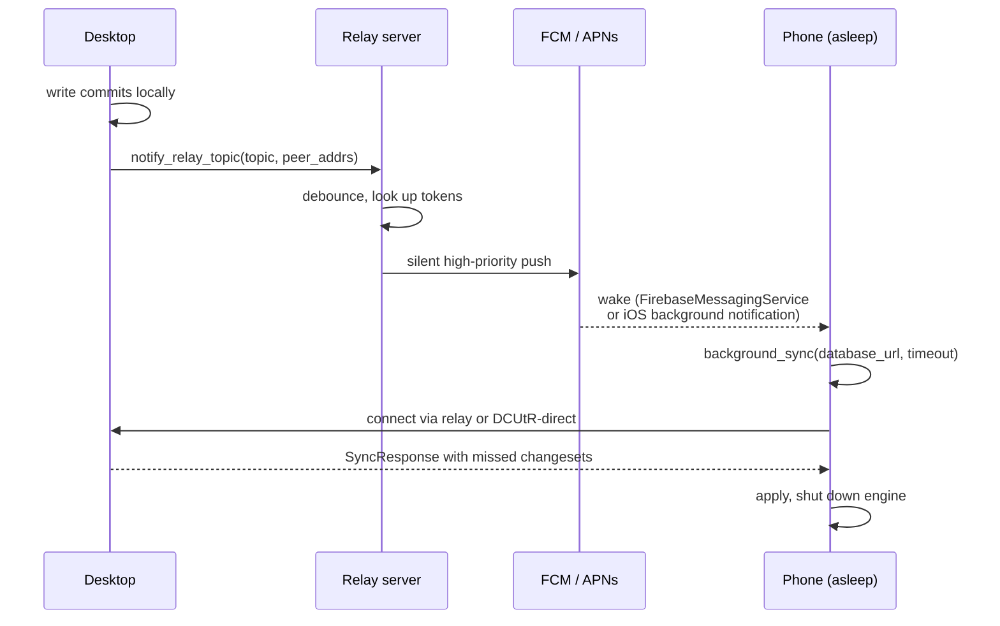

# Mobile & push notifications

When a phone is fully closed, libp2p connections are gone — the OS suspends every process and the sync engine is not running. WaveSyncDB solves this with **silent push notifications**: a relay server sends an FCM (Android) or APNs (iOS) wake signal that runs a one-shot background sync, pulls the latest changes, and shuts down.

The push carries no data. It is just a wake signal — the actual data transfers via the normal sync protocol once the engine is up.

## Architecture



## What you need

- A relay server. See [Relay deployment](/docs/relay-deployment).
- An **FCM service-account JSON** (for Android) and/or an **APNs `.p8` key** plus team/key/bundle ids (for iOS).
- A Firebase project with `google-services.json` configured for your Android app.
- iOS push entitlements set in your `Dioxus.toml` and a development/production APNs environment.

## Wiring on the client

Enable the `push-sync` feature on `wavesyncdb`:

```toml
wavesyncdb = { version = "0.5", features = ["derive", "dioxus", "push-sync"] }
```

That feature pulls in the FFI glue used by the platform-side service to call back into the Rust engine when a push arrives.

The native service (Android `FirebaseMessagingService` or iOS background notification handler) calls `wavesyncdb::background_sync::background_sync(database_url, timeout)`, which:

1. Loads the saved configuration (the same `WaveSyncDbBuilder` settings you used on first launch — written by `WaveSyncDbBuilder::build()` automatically).
2. Builds a fresh `WaveSyncDb` instance.
3. Initialises the schema registry.
4. Waits for peer discovery (mDNS or relay), requests a full sync, and applies incoming changesets.
5. Returns a `BackgroundSyncResult` and shuts down cleanly.

A typical wake-to-synced round on Wi-Fi takes ~1 second; on cellular via the relay, ~2–3 seconds.

## Wiring on the relay

The relay server reads service credentials from environment variables and listens for push tokens from clients. When a client emits `notify_relay_topic`, the relay looks up every peer registered for that topic and fans out FCM/APNs.

See [Relay deployment](/docs/relay-deployment) for the exact env vars and Dokploy compose file.

## What gets pushed

Pushes are silent and high-priority. They include the topic id and the sender's reachable peer addresses, which lets the receiving phone dial directly instead of waiting for discovery — saving ~500ms per wake.

The phone uses these addresses as bootstrap peers and falls back to the relay's circuit-relay address if the direct dial fails. On symmetric-NAT cellular this is the common case, and the circuit-relay path is reliable.

## Stages of a push-triggered sync

Each call to `background_sync` emits structured log lines at every stage so you can pinpoint where the wall-clock time goes:

| Stage | Typical wall-clock budget | What's happening |
|---|---|---|
| `config_loaded` | <50 ms | Reading `wavesync.json` next to the SQLite database |
| `engine_built` | 100–250 ms | Building the libp2p swarm, opening listening sockets |
| `registry_ready` | <50 ms | Schema registry initialised |
| `relay_listening` | 200–500 ms | AutoNAT confirmed private + circuit reservation accepted |
| `first_peer` | 100 ms (FCM-direct) — 1500 ms (cold) | First peer connection established |
| `sync_requested` | <10 ms | First catch-up VersionVector sent |
| `first_peer_synced` | 100–800 ms | Peer responded with changeset, applied locally |
| `done` | total: 1–3 s on Wi-Fi, 2–4 s on cellular | Engine shut down, result returned |

If a phase consistently takes much longer than this in your deployment, watch the logcat output and open an issue.

## Limits and gotchas

- FCM and APNs both rate-limit silent pushes. WaveSyncDB debounces at the relay (default 1 s) so a burst of writes generates one push, not N.
- iOS limits silent pushes per app per hour; high-frequency apps should consider explicit user-visible notifications for important events.
- On Android, `WaveSyncService` acquires a `WifiManager.MulticastLock` while the foreground sync runs so mDNS can race against the relay-introduced direct dial on Wi-Fi.
- Cold-cache JIT-compiling the Rust binary in the Android background process is slower than the foreground app — add roughly 200 ms to the typical numbers above on the first wake after a phone reboot.

## Further reading

- [Relay deployment](/docs/relay-deployment) — host the relay yourself with one Docker Compose file.
- [Networking & discovery](/docs/networking) — the discovery layers a phone tries on wake.
